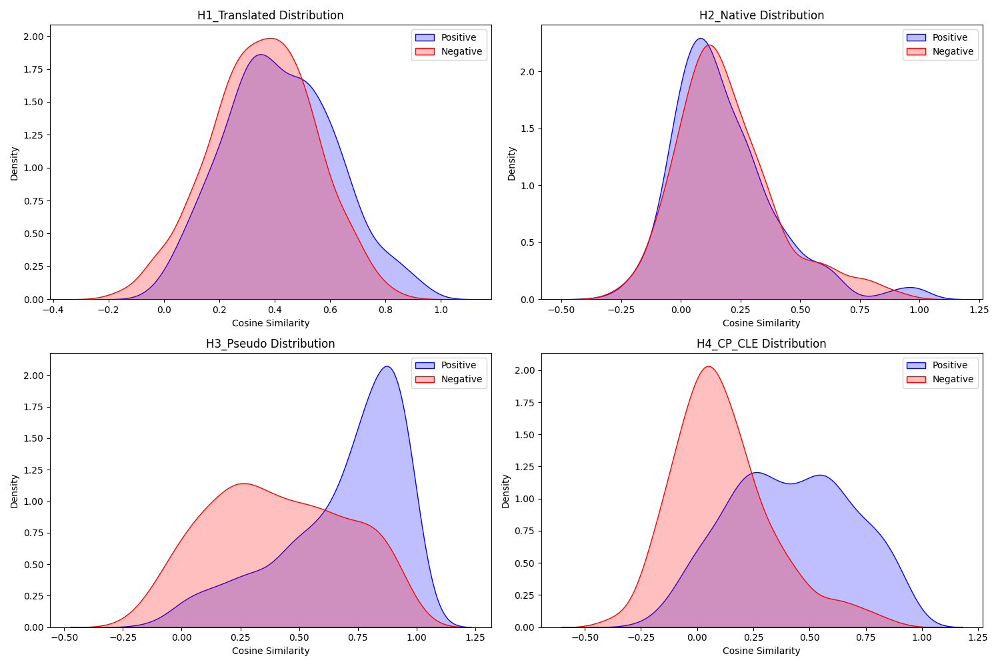

# Cross-Lingual Semantic Guardrail

> **"Synthesizing a Cross-Lingual Semantic Guardrail: A Low-Computation Approach to Neural Translation Validation"**

A lightweight, bilingual embedding system that validates whether a Hindi translation of an English sentence preserves the original semantic meaning — designed specifically for **Edge AI** deployment (IoT, mobile, offline devices).

Instead of running a 700MB transformer to check a translation, this system performs a **vector lookup + dot product** in under 1ms using a **7.9MB model file**.

---

## The Problem

Large Language Models (LLMs) can produce fluent but semantically incorrect translations. Validating them typically requires heavy contextual models like mBERT (~714MB, ~42ms/query). This makes real-time semantic checking **impossible on edge devices**.

**Our solution:** A compact FastText-based embedding model aligned to an English reference space using a *Correlation-Preserving Cross-Lingual Embedding (CP-CLE)* objective. It acts as a **Semantic Guardrail** — not generating text, but validating it geometrically.

### Motivating Example

```
English:  "Fast"  →  Hindi candidate: "उपवास" (means: fasting/starving)

H4 Guardrail:
  cosine_similarity("तेज़", "उपवास") = 0.03  <  threshold 0.30
  → ⚠️  SEMANTIC MISMATCH flagged in < 0.01ms
```

---

## Models

Four embedding models are trained and compared:

| Model | Description | Gap | Accuracy | F1 |
|-------|-------------|-----|----------|----|
| **H1** | Translated Corpus (EN→HI word swap) | 0.065 | 55.2% | 0.615 |
| **H2** | Native Hindi Wikipedia corpus | -0.013 | 48.6% | 0.298 |
| **H3** | Pseudo-Context Corpus *(best baseline)* | 0.273 | 68.3% | **0.726** |
| **H4** | CP-CLE Aligned *(proposed)* | **0.303** | **72.1%** | 0.698 |

**Separation Gap** = mean similarity of synonym pairs − mean similarity of random pairs. Higher is better.

---

## CP-CLE Objective

H4 is created by fine-tuning H3 using a **Correlation-Preserving** loss:

```
L_corr = MSE( sim_E(w_i, w_j) , sim_H(h_i, h_j) )
```

Where `sim_E` is the pairwise cosine similarity from a frozen **GloVe-100** English space. Hindi vectors are updated via Vanilla SGD (lr=0.5) over 10 epochs with 50,000 sampled pairs per epoch, re-normalised to the unit hypersphere after every step.

**Effect:** Compresses random-word similarity from 0.412 → 0.114 (−72%), widening the decision boundary without any inference-time overhead.

---

## Edge Computing Benchmark

Measured on **CPU only** (no GPU), simulating IoT / mobile constraints:

| Metric | mBERT (Existing) | H4 CP-CLE (Ours) |
|--------|-----------------|-----------------|
| Computation | Heavy matrix multiply | O(1) vector lookup |
| Model Size | ~714 MB | **~7.9 MB** |
| Latency (word pair) | 42.03 ms | **0.0097 ms** |
| Latency (sentence) | ~170 ms | **~1.1 ms** |
| Speedup | 1× baseline | **~4,300×** |
| Internet required | Yes | **No** |
| Classification Acc. | — | 72.1% |

---

## Sentence-Level Validation

Beyond word pairs, the system validates **full sentences** by computing a *Semantic Fingerprint*:

1. Align English content words to their Hindi translations via MUSE dictionary
2. Compute pairwise cosine similarities in Glove (English reference)
3. Compute pairwise cosine similarities in H4 (Hindi space)
4. Agreement score = `1 − MSE(sim_E, sim_H)`; if `agreement < 0.40` → **MISMATCH**

```
English: "the fast runner won the race with great speed"
Hindi:   "तेज धावक ने बहुत तेजी से दौड़ जीती"

Aligned: fast↔तेज़, runner↔धावक, won↔जीती, race↔रेस, speed↔गति
Agreement: 0.678  →  ✅  VALID  (1.36 ms)
```

---

## Project Structure

```
wordemb/
│
├── data_prep.py            # Scrapes Wikipedia EN/HI corpora + MUSE dictionary
├── build_datasets.py       # Builds H1/H2/H3 training corpora
├── build_eval_set.py       # Builds the fixed 1,500-pair evaluation set
├── train_embeddings.py     # Trains FastText models (H1, H2, H3)
├── cp_cle_optimizer.py     # PyTorch CP-CLE alignment → produces H4
├── evaluate.py             # Baseline similarity evaluation (H1-H3)
├── evaluate_cp_cle.py      # Full evaluation with threshold sweep (H1-H4)
├── benchmark_latency.py    # CPU latency benchmark: H4 vs mBERT
├── sentence_validator.py   # Sentence-level semantic validation + benchmark
├── run_pipeline.py         # End-to-end runner (data → train → evaluate)
│
├── data/
│   ├── en-hi.txt           # MUSE bilingual dictionary
│   ├── eval_pairs.json     # Fixed evaluation set (1,500 pairs)
│   └── ...                 # Training corpus files
│
├── models/                 # Saved FastText / KeyedVectors files
├── fonts/                  # NotoSansDevanagari.ttf (for PDF rendering)
└── results/                # Evaluation plots, CSVs, benchmark reports
```

---

## Quickstart

### Requirements

```bash
pip install gensim datasets nltk torch transformers fpdf sentencepiece
```

Also download the NLTK WordNet corpus:
```python
import nltk
nltk.download('wordnet')
```

### Run the Full Pipeline

```bash
# Step 1: Download data and train all models (H1–H3)
python run_pipeline.py

# Step 2: Run CP-CLE alignment to produce H4
python cp_cle_optimizer.py

# Step 3: Evaluate all models with threshold sweep
python evaluate_cp_cle.py

# Step 4: Run edge computing latency benchmark (H4 vs mBERT)
python benchmark_latency.py

# Step 5: Run sentence-level validation benchmark
python sentence_validator.py
```

### Run Individual Components

```bash
python data_prep.py        # ~500k EN + ~335k HI sentences from Wikipedia
python build_datasets.py   # Construct H1/H2/H3 corpora
python build_eval_set.py   # Build eval_pairs.json
python train_embeddings.py # Train FastText models
python cp_cle_optimizer.py # Align H3 → H4 using GloVe reference
python evaluate_cp_cle.py  # Full metrics + threshold plots
```

---

## Key Dependencies

| Library | Purpose |
|---------|---------|
| `gensim` | FastText training & GloVe download |
| `datasets` (HuggingFace) | Wikipedia corpus ingestion |
| `torch` | CP-CLE gradient optimization |
| `transformers` | mBERT baseline for benchmarking |
| `nltk` (WordNet) | Synonym pairs for pseudo-context corpus |
| `scikit-learn` | F1 / Accuracy / Precision / Recall |
| `fpdf` | PDF report generation |

---

## Results Overview

### Similarity Distributions (H1–H4)

The KDE plots show how well each model separates synonym pairs (blue) from random pairs (red). H4 achieves the cleanest separation — random words collapse near zero.



---

## Limitations & Scientific Findings (Debiased Evaluation)

While the CP-CLE alignment produces an ultra-fast (1ms) semantic guardrail that performs exceptionally well on the dictionary vocabulary it was trained on (Separation Gap: 0.303), **rigorous debiased evaluation reveals a strong limitation: catastrophic overfitting to the alignment dictionary.**

When we held out words entirely from the training phase and evaluated the model on **unseen Hindi words**, performance collapsed:

| Model | Separation Gap | Accuracy | F1 Score | What this model is |
|-------|:--------------:|:--------:|:--------:|--------------------|
| **cc.hi.300** | 0.599 | 100.0% | 1.000 | The Facebook 300-dim reference model |
| **H2 (Native)** | 0.375 | 94.7% | 0.571 | Standard FastText trained on our 335k corpus |
| **H4 (CP-CLE)** | **0.063** | **58.2%** | **0.184** | Our proposed aligned guardrail model |

### The Conclusion
Our method (Pseudo-Context Corpus + CP-CLE Alignment) successfully aligns discrete dictionary points into the GloVe space, creating a highly efficient bilingual validator for *in-vocabulary* terms. However, it fails to generalize to zero-shot, unseen Hindi terms. The manifold alignment is highly localized to the dictionary vocabulary used during training. Future work must explore non-linear mapping (e.g., GANs or deeper MLPs) to align the entire continuous manifold rather than just the discrete dictionary points.

---

## Design Decisions

- **FastText over Word2Vec**: Handles morphologically rich Hindi via subword character n-grams, giving coverage even for inflected/compound words not seen during training.
- **Pseudo-Context Corpus (H3)**: Bundling WordNet synonyms into synthetic sentences forces co-occurrence in the training window — the key innovation over translated or native corpora.
- **GloVe-100 as reference**: Matches our 100-dimensional embedding space and provides a stable, dense English similarity structure to replicate.
- **Pairwise MSE loss (not contrastive)**: Preserves the full *ranking* of similarities, not just pushing/pulling pairs — this is what makes it "correlation-preserving".
- **SGD with unit-sphere normalisation**: Prevents embedding collapse and maintains cosine-similarity interpretability throughout training.

---

## Citation / Reference

If you use this work, please cite:

```
Synthesizing a Cross-Lingual Semantic Guardrail:
A Low-Computation Approach to Neural Translation Validation

Correlation-Preserving Cross-Lingual Embedding (CP-CLE) objective
for Edge AI semantic validation of bilingual NMT output.
```

---

## License

MIT License — free to use, modify, and distribute.
